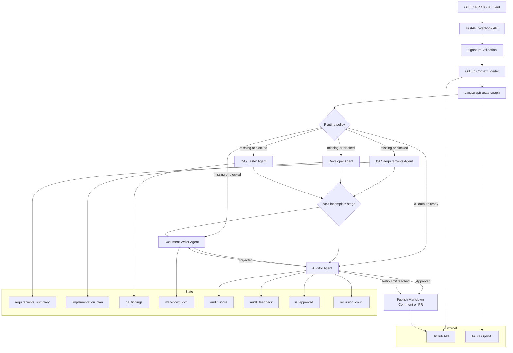
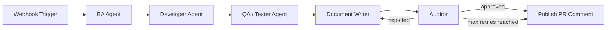

# SDLC Automation API

FastAPI and LangGraph service that receives GitHub pull request webhooks, gathers source and diff context, runs a multi-agent software delivery workflow, and publishes the final Markdown documentation as a pull request comment.

## Overview

This project implements a centralized LangGraph-based SDLC workflow for a pull request lifecycle. It coordinates several agent roles inside a single state graph:

- BA / Requirements Agent: turns the PR and repository context into structured requirements and scope
- Developer Agent: produces an implementation plan based on the code and diff
- QA / Tester Agent: highlights risks, missing validation, and quality concerns
- Document Writer Agent: drafts the final technical documentation in Markdown
- Auditor Agent: evaluates the generated documentation against source code and decides whether it is approved

The workflow is exposed as a FastAPI service and is designed to be triggered by GitHub webhook events.

## One-Page Architecture View



## Agent Status Flow

The workflow updates the shared state as each agent contributes.



Each agent fills a part of the shared state object:

- `requirements_summary`: captured by the BA agent
- `implementation_plan`: captured by the developer agent
- `qa_findings`: captured by the tester agent
- `markdown_doc`: produced by the document writer
- `audit_score` and `audit_feedback`: produced by the auditor
- `is_approved`: final approval signal from the auditor
- `recursion_count`: tracks how many writer/auditor cycles have occurred

## Agent Responsibilities

### 1. BA / Requirements Agent

Purpose:
- analyze the PR diff and source context
- summarize business requirements and implementation intent
- create a structured understanding of what the code change is trying to achieve

State updated:
- `requirements_summary`

### 2. Developer Agent

Purpose:
- convert requirements into a practical implementation plan
- capture sequencing, risk areas, and validation tasks

State updated:
- `implementation_plan`

### 3. QA / Tester Agent

Purpose:
- review likely failure points
- flag test gaps or validation concerns
- document readiness for release quality review

State updated:
- `qa_findings`

### 4. Document Writer Agent

Purpose:
- produce clean Markdown documentation from the repo, diff, and agent findings
- produce a final PR summary that is easy to understand and review

State updated:
- `markdown_doc`

### 5. Auditor Agent

Purpose:
- compare the generated Markdown against the actual source/diff
- apply a structured quality pass using Pydantic
- approve or reject the documentation

State updated:
- `audit_score`
- `audit_feedback`
- `is_approved`

If the document is rejected, the workflow loops back to the writer with the specific audit feedback until it is approved or the retry budget is exhausted.

## Workflow Behavior

The execution flow is centralized in the state graph defined in `app/graph/workflow.py`:

1. webhook event is accepted
2. repo and PR details are pulled
3. the routing policy checks each stage's status and output
4. only missing or blocked BA, developer, QA, and writer stages run
5. the auditor validates the generated or existing Markdown
6. rejected documentation sends only the writer back through the retry loop
7. approved docs are posted back to GitHub as a PR comment

The state graph uses the same single shared `SDLCState` object across all steps. Each agent writes a status such as `ok` or `blocked` alongside its output, so a later invocation can resume at the first incomplete stage without repeating completed work.

## Example State Progression

```python
initial_state = {
    "requirements_summary": "",
    "implementation_plan": "",
    "qa_findings": "",
    "markdown_doc": "",
    "audit_score": 0,
    "audit_feedback": "",
    "is_approved": False,
    "recursion_count": 0,
}
```

After each stage:

```python
{
    "requirements_summary": "User story and technical intent",
    "implementation_plan": "Implementation plan and task breakdown",
    "qa_findings": "Test risks and validation notes",
    "markdown_doc": "# Pull Request Documentation",
    "audit_score": 95,
    "audit_feedback": "Good technical coverage and accurate summary",
    "is_approved": True,
    "recursion_count": 1,
}
```

## Local development

```powershell
python -m venv .venv
.\.venv\Scripts\Activate.ps1
python -m pip install -e ".[dev]"
Copy-Item .env.example .env
uvicorn app.main:app --reload
```

The service exposes `GET /health` and `POST /webhook/github`. Live GitHub and Azure OpenAI calls are isolated behind `PullRequestClient` and the injectable graph model interfaces, so tests require no secrets.

Run tests with:

```powershell
python -m pytest
```

Or start the local container with:

```powershell
docker compose up --build
```

## Verified deployment status

The first end-to-end deployment was verified with a documentation-only pull request.

- Azure Container Apps revision was healthy with 100% traffic.
- GitHub `pull_request.synchronize` deliveries returned `202 Accepted`.
- The webhook signature was validated successfully.
- Azure OpenAI `gpt-5-mini` completed the agent workflow after quota was increased.
- The generated Markdown comment was published to the pull request.

The deployed endpoint is intentionally public HTTPS because GitHub must reach it. The webhook route is protected by HMAC signature validation, supported-action filtering, delivery-id replay protection, and a 1 MB payload limit.

## Deployment blockers and resolutions

These issues were encountered during the first deployment and are useful operational guidance:

| Symptom | Cause | Resolution |
|---|---|---|
| `MANIFEST_UNKNOWN: latest` | The Container App was created before the image existed in ACR. | Build and push `sdlc-automation:latest` or an immutable tag before creating the app revision. |
| Empty Container App secrets rejected | Phase 2 was attempted without GitHub and Azure OpenAI values. | Set secrets in the same PowerShell session or through Portal before deploying the workload. |
| Azure OpenAI `400` for `temperature` | `gpt-5-mini` does not accept the configured temperature value. | The live client configuration omits `temperature`. |
| Azure OpenAI `429 rate_limit_exceeded` | The shared deployment started with only 1K TPM / 1 RPM. | Increase the deployment quota or wait for the quota window before redelivery. |
| GitHub `401 Bad credentials` | The token stored in Container Apps was invalid, stale, or incorrectly copied. | Replace `github-token` with a verified token and restart/create a revision. |
| GitHub `403` creating issue comments | The token could read the PR but lacked comment-write access. | Grant Issues: Read and write; Pull requests: Read-only is sufficient for this adapter. |
| Webhook `401 Invalid signature` | GitHub's webhook secret differed from Azure's `github-webhook-secret`. | Set exactly the same random secret in both systems. |
| Webhook `duplicate` on redelivery | GitHub reused a delivery ID already claimed by the replay guard. | Failed workflows now release the ID; otherwise create a new `synchronize` delivery. |

The first implementation uses FastAPI `BackgroundTasks` and an in-memory replay guard. Keep one replica until delivery tracking moves to shared storage or a queue-based worker is introduced.

## Repository setup

The repository includes a root [.gitignore](.gitignore) covering Python caches, virtual environments, build output, local `.env` files, Azure local artifacts, logs, and editor files. `.env.example` remains tracked as a placeholder template; real `.env` files and credentials must never be committed.

To initialize version control locally:

```powershell
git init
git add .
git commit -m "chore: initialize LangGraph SDLC automation"
git branch -M main
git remote add origin https://github.com/<owner>/<repository>.git
git push -u origin main
```

Review `git status` and `git diff --cached` before the first commit, especially for environment files or generated credentials.

## Azure and GitHub deployment

The FastAPI service is intended to run in Azure Container Apps with public HTTPS ingress. GitHub.com must be able to reach the webhook URL, but the application does not expose an unauthenticated workflow API: webhook requests must have a valid HMAC signature.

### Azure setup

Run these commands from an authenticated Azure CLI session. Replace the placeholder values before running them:

```powershell
$env:AZURE_LOCATION = "<azure-region>"
$env:AZURE_RESOURCE_GROUP = "<resource-group-name>"
$env:AZURE_ACR = "<globally-unique-acr-name>"
$env:AZURE_CONTAINER_ENV = "<container-apps-environment-name>"
$env:AZURE_CONTAINER_APP = "<container-app-name>"

az group create --name $env:AZURE_RESOURCE_GROUP --location $env:AZURE_LOCATION
az acr create --name $env:AZURE_ACR --resource-group $env:AZURE_RESOURCE_GROUP --sku Basic
az acr build --registry $env:AZURE_ACR --image sdlc-automation:latest .
az containerapp env create --name $env:AZURE_CONTAINER_ENV --resource-group $env:AZURE_RESOURCE_GROUP --location $env:AZURE_LOCATION
az containerapp create `
    --name $env:AZURE_CONTAINER_APP `
    --resource-group $env:AZURE_RESOURCE_GROUP `
    --environment $env:AZURE_CONTAINER_ENV `
    --image "$env:AZURE_ACR.azurecr.io/sdlc-automation:latest" `
    --registry-server "$env:AZURE_ACR.azurecr.io" `
    --target-port 8000 `
    --ingress external `
    --min-replicas 1 `
    --max-replicas 1
```

Create an Azure OpenAI resource and chat-model deployment in the Azure portal or with the Azure CLI. Record its endpoint, deployment name, and API version. Generate a strong random webhook secret and use the same value in GitHub and Container Apps. Then configure secrets and environment variables without putting credentials in the image:

```powershell
az containerapp secret set `
    --name $env:AZURE_CONTAINER_APP `
    --resource-group $env:AZURE_RESOURCE_GROUP `
    --secrets `
        github-token="<github-app-token>" `
        github-webhook-secret="<random-webhook-secret>" `
        azure-openai-api-key="<azure-openai-key>"

az containerapp update `
    --name $env:AZURE_CONTAINER_APP `
    --resource-group $env:AZURE_RESOURCE_GROUP `
    --set-env-vars `
        GITHUB_TOKEN=secretref:github-token `
        GITHUB_WEBHOOK_SECRET=secretref:github-webhook-secret `
        AZURE_OPENAI_API_KEY=secretref:azure-openai-api-key `
        AZURE_OPENAI_ENDPOINT="<azure-openai-endpoint>" `
        AZURE_OPENAI_DEPLOYMENT="<deployment-name>" `
        AZURE_OPENAI_API_VERSION="2024-10-21"
```

Retrieve the public hostname and verify the probe before configuring GitHub:

```powershell
$env:APP_HOST = az containerapp show --name $env:AZURE_CONTAINER_APP --resource-group $env:AZURE_RESOURCE_GROUP --query properties.configuration.ingress.fqdn --output tsv
Invoke-RestMethod "https://$env:APP_HOST/health"
```

### GitHub setup

Use a GitHub App for production rather than a personal access token:

1. Create a GitHub App under the organization settings.
2. Grant repository permissions: **Contents: Read**, **Pull requests: Read**, and **Issues: Write**.
3. Subscribe the App to **Pull request** events and install it only on the target repositories.
4. Generate an installation token or otherwise provide the App credential through `GITHUB_TOKEN`.
5. In the repository, open **Settings -> Webhooks -> Add webhook**.
6. Set the payload URL to `https://<container-app-fqdn>/webhook/github`.
7. Set content type to `application/json`.
8. Set the webhook secret to the same value as Azure secret `github-webhook-secret`.
9. Select only **Pull requests** and activate the webhook.
10. Test with GitHub's **Recent Deliveries** page and confirm a `2xx` response.

The service processes only `opened`, `reopened`, `synchronize`, and `ready_for_review` pull-request actions. Other actions are acknowledged with `ignored`. GitHub's `X-GitHub-Delivery` ID is required and duplicate IDs are suppressed to avoid repeated workflow execution.

### Security and scaling notes

- Keep Container Apps ingress external only because GitHub.com needs public access; rely on HMAC verification rather than hiding the URL.
- Container Apps secrets are injected by reference and are not stored in the Docker image or source repository.
- The current replay guard is bounded and in-memory. Keep `min-replicas` and `max-replicas` at `1` for this first deployment. Before scaling out, move delivery IDs to a shared store such as Azure Table Storage, Cosmos DB, Redis, or a queue with duplicate detection.
- FastAPI `BackgroundTasks` is suitable for the initial low-volume deployment. For durable processing and retries, place webhook work on Azure Service Bus or Storage Queue.
- Restrict Azure OpenAI and GitHub permissions to the minimum required scope, enable diagnostic logging, and rotate webhook and API credentials regularly.
